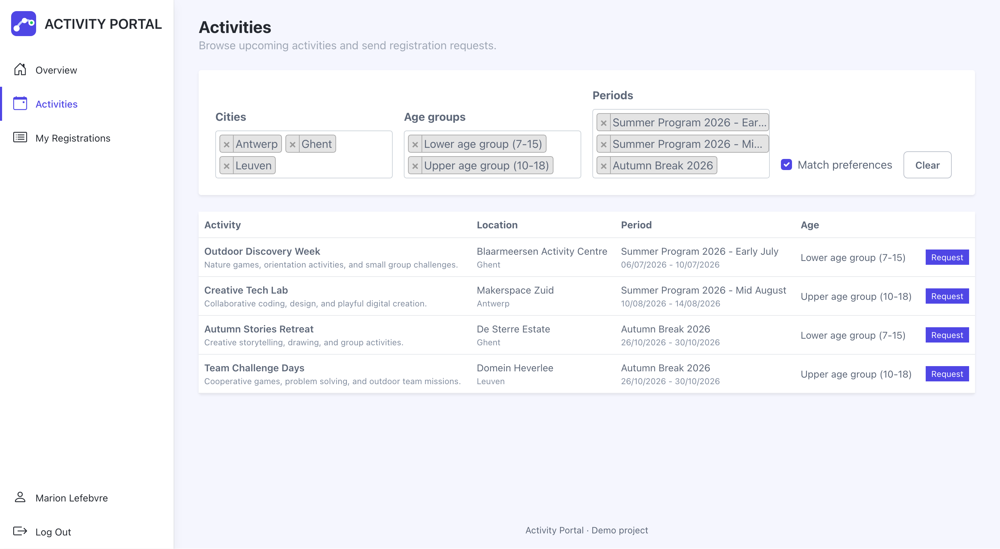
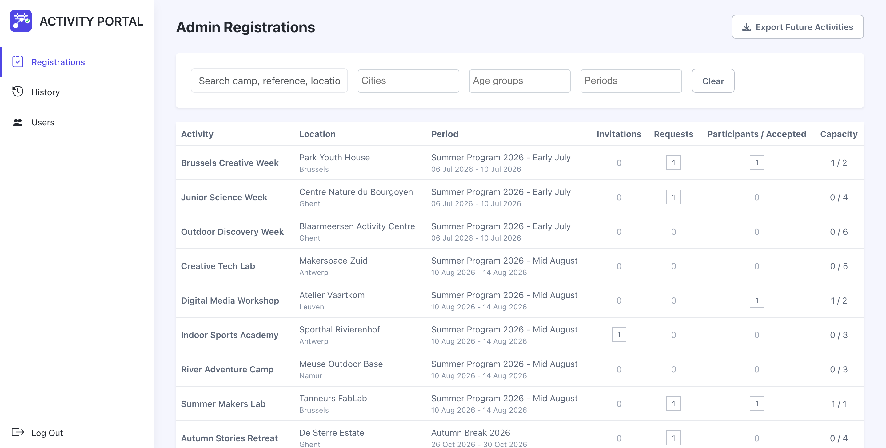
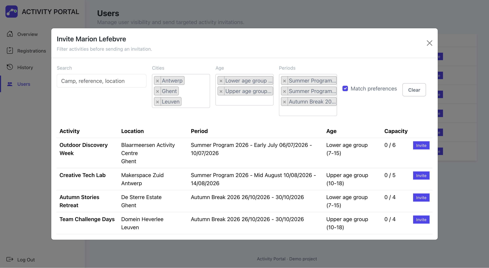

# Activity Portal

Activity Portal is a Laravel demo application rebuilt from a business need encountered in a professional context.

It focuses on a common internal-tool problem: helping an organization match users with relevant activities, track registration requests, send targeted invitations and keep a clear operational view of upcoming activities.

## What This Project Demonstrates

- Building a complete Laravel application around internal team workflows
- Separating user and administrator roles
- Managing registration requests, invitations and status transitions
- Filtering activities through user preferences and operational criteria
- Sending notification emails for key registration events
- Exporting upcoming activities to Excel

## Demo Preview





## Main Features

User side:

- Browse and filter available activities
- Save preferences and apply them to activity results
- Send registration requests
- Review active registrations
- Accept or decline invitations

Admin side:

- Review registrations from an operational dashboard
- Accept or reject user requests
- Review user preferences before inviting them
- Send targeted invitations to relevant activities
- Export upcoming activities to Excel

## Tech Stack

- Laravel 12 / PHP 8.2+
- Laravel Breeze authentication
- Blade, Alpine.js and Vite
- Maatwebsite Excel

## Local Installation

The project requires PHP 8.2+, Composer and Node.js/npm.

```bash
git clone https://github.com/RayaneLamri/activity-portal.git
cd analytics-bridge
composer install
npm install
cp .env.example .env
php artisan key:generate
touch database/database.sqlite
php artisan migrate --seed
npm run build
php artisan serve
```

The `migrate --seed` command creates demo accounts and realistic scenarios.

The application is available at:

```txt
http://127.0.0.1:8000
```

To reset the local database and restore the demo data:

```bash
php artisan migrate:fresh --seed
```

## Demo Accounts

All seeded accounts use the password:

```txt
password
```

```txt
admin@example.test
marion@example.test
antoine@example.test
enzo@example.test
maxime@example.test
leslie@example.test
```

## Local Demo Flow

The seeders cover the main business cases: varied activities, user preferences, requests, invitations, acceptances, rejections, status history, partially filled capacities and a hidden/inactive user.

To test both sides of the flow, open two sessions:

- a regular browser window with `admin@example.test`;
- a private browser window with `marion@example.test`.

Suggested path:

1. As a user, browse activities, apply preferences and send a registration request.
2. As an admin, review the request, accept or reject it, and export upcoming activities.
3. As an admin, send a targeted invitation to a user.
4. As a user, accept or decline the invitation.

Emails can be tested locally with Laravel's `log` mail driver:

```env
MAIL_MAILER=log
MAIL_FROM_ADDRESS="demo@activity-portal.test"
MAIL_FROM_NAME="Activity Portal"
```

## Credits

Visual base adapted from the [Portal - Bootstrap 5 Admin Dashboard Template](https://themes.3rdwavemedia.com/bootstrap-templates/startup/portal-free-bootstrap-admin-dashboard-template-for-developers/).
