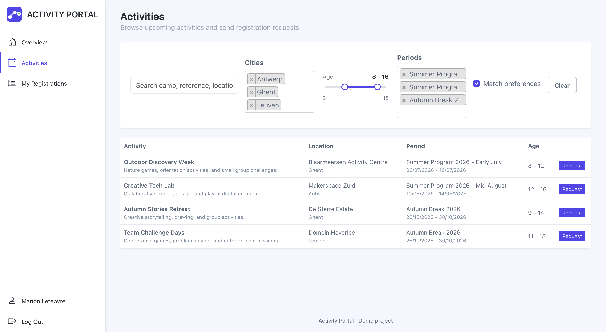
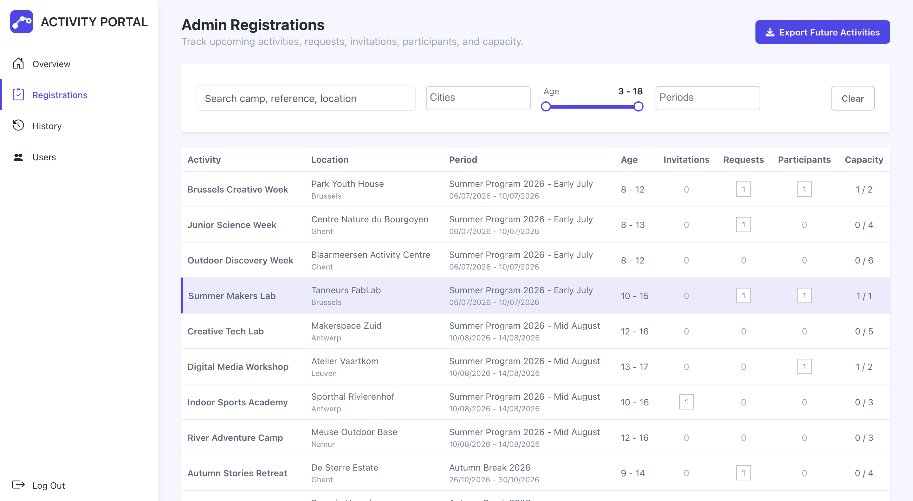
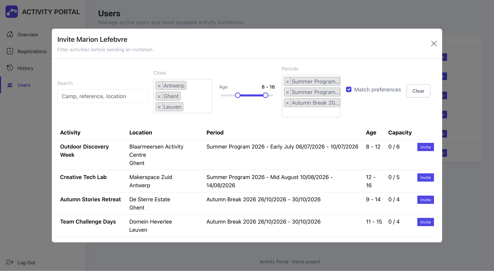

# Activity Portal

Activity Portal is a Laravel application that centralizes activity management, registrations and invitations into a single tool.

The project addresses an internal organization problem: when activities, registrations and invitations are spread across multiple tools, operational visibility becomes harder. The application centralizes these workflows and allows users, registrations and invitations to be managed from a single entry point.

## Main Features

- Separation between user and administrator roles
- Registration requests, invitations and status transition management
- Activity filtering based on user preferences
- Email notifications for key registration lifecycle events
- Export upcoming activities to Excel

## Demo Overview





## How It Works

### User side

- Browse and filter available activities
- Save preferences and apply them to results
- Send registration requests for relevant activities
- View current registrations
- Accept or decline invitations

### Administration side

- Track registrations through an operational dashboard
- Accept or reject user requests
- Review user preferences before sending invitations
- Send invitations for relevant activities
- Export upcoming activities to Excel

## Technical Stack

- Laravel 12 / PHP 8.2+
- Laravel Breeze authentication
- Blade, Alpine.js and Vite
- Maatwebsite Excel

## Local Installation

The project requires PHP 8.2+, Composer and Node.js/npm.

```bash
git clone https://github.com/RayaneLamri/activity-portal.git
cd activity-portal
composer install
npm install
cp .env.example .env
php artisan key:generate
touch database/database.sqlite
php artisan migrate --seed
npm run build
php artisan serve
```

The `migrate --seed` command creates demo accounts and realistic scenarios.

To reset the local database and restore demo data:

```bash
php artisan migrate:fresh --seed
```

## Demo Accounts

All generated accounts use:

```txt
password
```

```txt
admin@example.test
marion@example.test
antoine@example.test
enzo@example.test
maxime@example.test
leslie@example.test
```

## Suggested Demo Flow

Seeders cover common business cases: multiple activities, user preferences, requests, invitations, acceptances, rejections, status history, partially filled capacities and hidden/inactive users.

To test both sides of the workflow, open two sessions:

- one normal browser window with `admin@example.test`
- one private window with `marion@example.test`

Suggested flow:

1. As a user, browse activities, apply preferences and send a registration request.
2. As an administrator, review the request, accept or reject it, then export upcoming activities.
3. As an administrator, send a targeted invitation.
4. As a user, accept or reject the invitation.

Emails can be tested locally with Laravel's `log` mail driver, or with a local SMTP tool such as Mailtrap:

```env
MAIL_MAILER=log
MAIL_FROM_ADDRESS="demo@activity-portal.test"
MAIL_FROM_NAME="Activity Portal"
```

## Credits

Visual base adapted from [Portal - Bootstrap 5 Admin Dashboard Template](https://themes.3rdwavemedia.com/bootstrap-templates/startup/portal-free-bootstrap-admin-dashboard-template-for-developers/).
